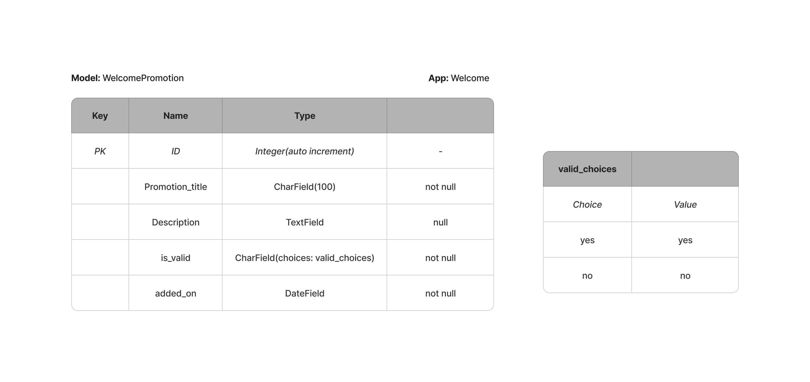
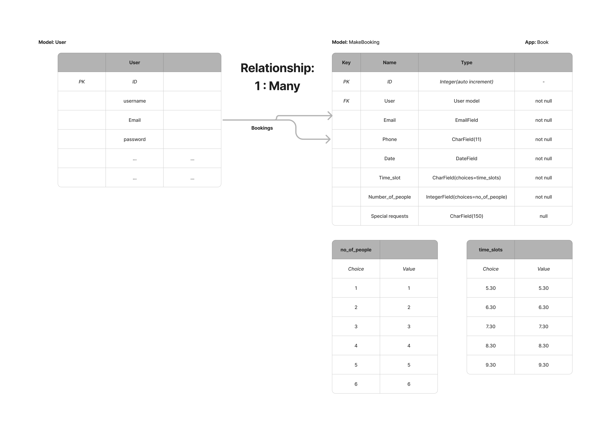
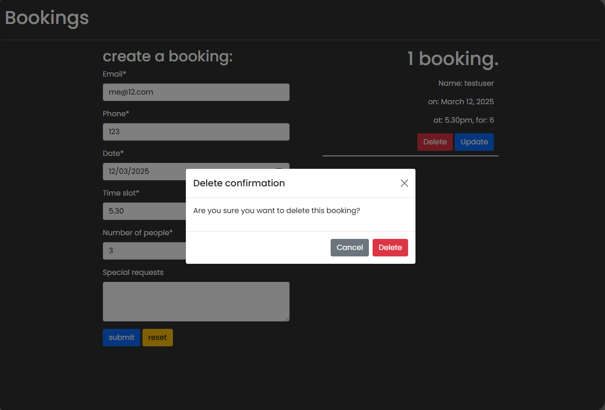

# Sultan's using Django, Python and Postgres.

## Introduction
Welcome to Sultan's restaurant! A website offering a prestigious menu and booking facility, allowing users to conveniently create and manage bookings at the restaurant.

The intended purpose is to provide a seamless experience with a user-friendly menu and streamlined booking process. Allowing users to view the menu and managing bookings at a time and on a device that suits. Potentials users of the site can include regular customers who know exactly what they want to eat and when or food enthusiasts venturing out to explore the rich culinary experience Sultan's has to offer.  
## Table of Contents

### [User Experience (UX)](#user-experience-ux-1)

* User Stories

* Mind Map: Ideas

* Wireframe Designs 

* UX View

* Pseudo - functions needed (Brainstorm)

* Process Map

* Models and Entity Relationship Diagrams

### [Project Walkthrough](#project-walkthrough-1)

* Roles
* Home
* Menu
* Book
* About us

### [Testing](#testing-1)

* Fixed Bugs 

* Validation Testing

* Manual Testing

* Automated Testing

* User Story Testing 

### [Future Developments](#future-developments-1)

###  [Workload Planning](#workload-planning-1)

###   [Site Production, Deployment and Contribution](#site-production-deployment-and-contribution-1) 

 * Site production

 * Deployment

 * Contribution

### [Technologies and tools Used](#technologies-and-tools-used-1)

* Languages used

* Frameworks, Libraries and Programs Used
     	
### [Credits](#credits-1)

* Content

 * General
  
 * Overall Credit

### [Personal Summary](#personal-summary-1)

## User Experience (UX)
### User Stories

The initial step taken was to the establish the user stories identifying the needs and requirements for the site. These have further provided the foundation for the project allowing me to categorise the development and deployment using agile methodology.

Each user below contains the initial story along with acceptance criteria. These both would need be satisfied during development and testing for the user story to be deemed a success.

### **US1:** As a **customer** I can **create a booking reservation online** so that **I can secure the booking**
#### Acceptance Criteria

- The customer should be prompted to register and/or login. 
- The site should authenticate the user so that bookings can be attached to them.
- The booking form should include fields: 
    -  contact number (required)
    - email (required)
    - time slot (required)
     - date (required)
     - number of people (required) 
    -  special requests (optional)
    
- The booking form should be validated for any errors/missing values.
- On a successful booking, the customer should receive a notification.
- The customer should only be able to see their own bookings.

### **US2:** As a **customer** I can **delete the booking** so that **I can create again at another time**
#### Acceptance Criteria

-	The customer should be authenticated so they can only see their own bookings.
-	The customer should be able to select the relevant booking to delete.
-	The customer should be asked to confirm the delete.
-	The customer should receive a notification once the delete has been completed. 
-	The booking should be removed from the customer’s account.

### **US3:** As a **customer** I can **update my booking** so that **I can fit it around my schedule**
#### Acceptance Criteria

-	The customer should be authenticated so they can only see their own bookings.
-	The customer should be able to select the relevant booking to update.
-	The selecting booking information should be place in the booking form for the customer to update.
-	The site should check availability of the said changes.
-	The site should update the booking if there is availability.
-	The customer should receive a notification of the update.

### **US4:** As a **customer** I can **see the menu online** so that **I can decide what I want to eat beforehand**
#### Acceptance Criteria

- The menu should be accessible on all devices in a clean and easy to read format.
- The menu should contain all the items currently being served at the restaurant.
- Each item should have a name, description (where applicable) and a price.
- Unavailable items are not shown/marked as unavailable.
- Menu is broken down into the relevant categories for ease.
- Any allergen information is easy to find. 

### **US5:** As a **manager** I can **update the menu** so that **customers can see the latest menu**
#### Acceptance Criteria

- The manager should be able to login and be validated as such.
- A link should be made available for the manager to update the menu.
- The manager should be able to navigate to the menu section.
- Each menu item has a name, an option description, price, and status which should be filled in.
  -   Status should allow for the item to be active/inactive from the menu.
- The manager should be able to add new items to the menu.
- The manager should be able to delete/update current items in the menu.
   -   An item being deleted should ask for confirmation of deletion.
- Any changes made should be reflected on the live menu.

### **US6:** As a **admin** I can **add promotions to the home page** so that **the customer can see these as they become live**
#### Acceptance Criteria

- The admin should be able to login and be validated as such.
- The admin should be able to navigate to the welcome promotions section.
- The admin should be able to add/update/delete any special offers.
  -  Should have the option to "toggle" active/previous promotions.
- Any changes made should be reflected on the live site.

### **US7:** As a **manager** I can **manage bookings via the admin panel** so that **I can efficiently manage the restaurant**
#### Acceptance Criteria

- The manager should be able to easily navigate to the bookings section.
- The manager should be able to see all the bookings and the related information.
- The manager should be able to search using the following.
     - Name
     - Contact info (number/email)
     - Date
- The manager should be able to create/edit/delete bookings.
    - The delete should prompt a confirmation.
    - new/edited bookings should be shown in the customer's account to view.

### **US8:** As a **super user** I can **create accounts for the staff** so that **they can help the managers when things are busy**
#### Acceptance Criteria

- The super user should be able to create staff accounts as requested by management.
- The accounts should have specific permissions on the admin panel for certain members.
- The staff accounts should only be able to see/use areas permitted on the admin panel.

**Please Note**: The acceptance criteria may be added to/updated within the agile tool to allow implementation of the core requirements in the user stories.

### Mind Map: Ideas

Following on from the user stories, an initial mind map(pen to paper) was created to capture functionality of the site. The purpose of this was to provide a high-level understanding of how the user stories could be implemented:

### Wireframe Designs

The next step taken was to create wireframes (shown below) using Balsamiq. These wireframes illustrate the planned layouts and components to be used to satisfy the user stories.

[Back to Contents.](#table-of-contents)

### UX View

Following on from the wireframe designs, final UX views of the site were created:

[Back to Contents.](#table-of-contents)

Completion of the UX element provided a clear refined picture of the finished product. The definition of colours, classes, placements, and components provided all the necessary information to develop the site ensuring a positive user experience.  

### Pseudo - functions needed (Brainstorm)

On completion of the UX element, the next step take was to map out the functions needed for the booking system to perform as needed: 

### Process Map

The diagrams below map out the processes and paths taken based on the choices made and the validation outcome:

These process maps have played an essential part as a reference guide during the development. They have allowed me to ensure that all requirements and acceptance criteria from the user stories have been satisfied. 

**Please note:** The process to add, update, or delete promotions and menu items is carried out via the admin panel. The purpose of the process maps for this functionality is to highlight suitability and how it aligns with the project goals.

[Back to Contents.](#table-of-contents)

### Models and Entity Relationship Diagrams (ERD's)

The project is broken down into four models:

1. WelcomePromotion - for the promotions on the home page.
2. MenuItem - for the menu items.
3. MakeBooking - for the bookings.
4. AboutUs - for the content on the about us page. 

#### 1. WelcomePromotion

The welcome model contains the setup:

- promotion_title:  the title for the promotion.
- description: description of the promotion.
- is_valid: whether the current promotion is running or not.
- added_on: automated date on when the promotion was added.

The ERD schema for the WelcomePromotion model is displayed below:

#### 2. MenuItem

The MenuItem model contains the setup:

- name: name of the item.
- description: description of the item.
- category: category choices( Starter, Main, Side, Dessert, Drink).
- price: cost of the item.
- added_on: automated date on when the item was added to the menu. 
- active: whether the item is available or not.

The ERD schema for the MenuItem model is displayed below:

#### 3. MakeBooking

The MakeBooking model contains the setup:

- user: the individual creating the booking. This is retrieved from the User model. 
- email: email for the booking.
- phone: phone for the booking.
- date: date of the booking.
- time_slot: time for the booking.
- number_of_people: number of people on the booking.
- special_requests: any special requests for the booking (e.g. birthday).

The ERD schema for the MakeBooking model is displayed below:

#### 4. AboutUs

The AboutUs model contains the setup:

- name: name of the entry.
- description: content for the current entry.
- added_on: automated date on when entry was added in.
- is_valid: whether the current about us content is displayed or not. 

The ERD schema for the AboutUs model is displayed below:

**Please note:** fields containing the value null have the option to remain blank as they are optional.

[Back to Contents.](#table-of-contents)

## Project Walkthrough

### Roles

For the purposes of this project, roles with specific permissions have been setup and are as follows:

**manager:** The manager account has been setup so that they can:
- add/update/delete promotions on the home page.
- update content on the about us page.
- add/update/delete items on the menu.

**admin:** The admin account has been setup so that they can:
- add/update/delete promotions from the home page.

**testuser:** The testuser account is a customer regular at Sultan's, registered via the website and can:
- add/update/delete their own bookings.
- can only see their own bookings when logged in.

For clarity, these accounts will be referenced throughout this document.

**Please note:** The management of the menu, promotions and about us content is done using Django's admin panel. It is proposed as future developments to incorporate this into the front-end design reducing the need to use the admin panel.

## Home

The site presents a clean, elegant design with the aim of providing a welcoming atmosphere. The user is presented with a crisp layout, in an easy flowing colour scheme. The user's attention is captured by promotions available which are presented in an eye-catching way. The site is accessible on multiple devices giving a seamless user experience as illustrated below:

_**Image above generated using https://ui.dev/amiresponsive illustrating the responsiveness of the site.**_

### Features
#### Navigation

- The top of the page features a navigation menu with the site links available to the right.
- home, menu, book, about us, login, register links: these take the user to the respected pages. 
- The navigation menu is available through the site and is styled reflecting which page the user is currently on(in bold) and which link is being hovered over (in red).

#### Menu - toggle
 
 - Devices running in other views such as mobile are presented with a light version of the menu that can be expanded as need providing the same functionality as the full version:

 

 If a staff user (manager or admin) logs in, the menu updates with an additional link to the admin panel is usefully made available:

 

 Below the menu, the user is welcomed to the site and instantly made aware of any special promotions that are running at the restaurant:

The homepage also provides additional user interaction by placing convenient links to the menu and the bookings page in a clear manner. The placement of these links highlights the ease of access to the services on offer:

Should the admin add, update, or remove any current promotions via the admin panel, these changes are reflected instantly on the live home page:

#### Footer

- The footer contains links to the respected social media sites Facebook, X, Instagram, and YouTube using font awesome icons.
- These links are all opened in a new tab.
- The footer is available on all pages.

**Please note:** There are currently no active social media pages for Sultan's. These links have been added in as place holders only. 

[Back to Contents.](#table-of-contents)

## Menu
### Features

Navigating to the menu page the user is presented with simple but effective layout. The menu has been broken down into the relevant categories to provide maximum user experience:

The user has the option to select any heading as they please resulting in a fully responsive, interactive menu that provides the requested information. The menu items are listed with their name, description (if applicable) and price:

There is an allergen note made available at the bottom of the menu, ensuring that any necessary information is available to user along with any dietary information.

Like the promotions on the home page, if the manager adds, updates, or removes any items from the menu, these changes are reflected instantly. This ensures that that site always provides the latest version of the menu.

[Back to Contents.](#table-of-contents)

## Bookings
### Features

The booking page requires the user to be logged in. The purpose of this login is to ensure that only the logged in user can create, update, or delete a booking, which is reflected within their account. The initial navigation to this page presents the following:

If the user already has an account with Sultan's, they are welcome to login. On successful login, they are re-directed to the bookings page under their account. 

If the user is a new visitor to the site and does not have an account, they have a link available on the login page and the navigation menu to register:

The registration process is simple; a username, optional email and a password that meets the criteria given. Once registered, the user is logged in as this registered user and automatically logged in:

**Please Note:** The assumption is now that the testuser has logged in for the remainder of this section.

Once logged, the booking page features a form allowing testuser to create a booking. The information collected on the form is:

- Email - required field (in the correct format).
- Phone - required field (in the correct format with a maximum of 11 numbers).
- Date - required field ( from today onwards)
- Time slot - required field.
- Number of people - required field.
- special requests - optional.

On submission of the form, the required fields are validated. If there are any errors, these are highlighted accordingly, prompting correction.

In addition to the validation, there is a requirement for the date to be valid; it can only be from today onwards. Should the date be prior to today, an alert is given:

[Back to Contents.](#table-of-contents)

### Create Booking

On a successful submission of the form, the site will perform an availability check to ensure that the date and time requested by testuser is available to book. If available, the booking will be created, testuser notified, and the booking details made available in testuser's account:

If there is no availability, testuser is notified accordingly:

The options to update and delete the booking are now available to testuser.

### Update Booking

To update the booking, the "Update" button is clicked which takes testuser to the update booking page. This page pre-populates the form with the current details make the process quick and easy:

Testuser now can simply go in and update fields such as the number of people, or special requests, and save the form. If the date and time are to change, this would need to be checked for availability. If there is availability, the booking is updated, and an alert displayed:

If there is no availability, like creating a booking, an alert is displayed. 

Should testuser want to navigate back to the bookings page, and select another booking, there is a "click here" link available to do this. 

[Back to Contents.](#table-of-contents) 

### Delete Booking

To delete the booking, the "Delete" button is selected which displays an alert asking for confirmation of the delete:

Once the delete has been confirmed, the selected booking is deleted and no longer visible in testuser's account. An alert is also displayed confirming the delete:

### Booking Management

The manager can manage all the bookings that have been created. Once logged in, and authenticated as having access to the admin panel the manager will have total visibility:

From here, the manager can create, update, or delete bookings. Once the necessary action has been performed, the respected user account will show the changes.

In addition to this, to allow the management of bookings to be as efficient as possible, the manager has the facility to search by username, email, and phone. Filtering options are also available and include date and time slot which can be seen on the right of the screen.

## About us

The about us page highlights the core values of Sultan's in the clear, easy to ready format that is seen throughout the site:

The manager can update and style the content on the about us page as needed. This includes, colours, spacing and font size as examples. 

**Please Note:** The assumption is that there will only be one entry active at one time, managed at a local level. The site ensures that only the latest version of this entry is always displayed.

To complete the current logged in session, a logout option is available on the menu bar which prompts confirmation:

Once confirmed, the testuser is logged out and the site is ready for the next user.

[Back to Contents.](#table-of-contents) 

## Testing

### Fixed Bugs 

### Fixed Bugs 
* **Issue 1 (ID 2f88738):** Bookings were successfully being created but not attached to the user creating them. This meant that any logged in user was able to see all the bookings created.

  * **Fix (ID 7bebcc1):** This was fixed by adding a filter to the query fetching the current bookings. The filter only returned bookings where the user making the bookings was the same as the user currently logged in. This was tested with 2 individual test accounts to ensure it worked as it should be.

* **Issue 2 (ID 6ad7f00):**  The booking form "phone" field allowed for non-digit characters to pass through as valid. The same phone field was validated correctly within the admin panel using the regex in place.

* **Fix (ID 2c4527c):** This was fixed by adding a custom validation on the form field to raise an error if the entered data did not consist of all digits. The validation error displayed using the Django message network.

This was further refined (ID 13ea71e) with the installation of crispy forms. After testing, the validation was being returned correctly and displayed in line with the other form validation. This was tested further over the next few commits and the custom validation removed as it was no longer needed.

* **Issue 3 (ID 13ea71e):** 
**_Note_**: This bug was found after the commit.

If the fields other than the date and time were being updated, the booking was being noted as a duplicate and alerting the user as such. For example, if the booking required the addition of people with a special request of "surprise meal"  on the same date and time slot, the booking was not being updated.

* **Fix (ID c2e3c54):** This was fixed by refactoring the update booking function as follows:
1. Check if the form is valid.
2.  store the forms date and time slot.
3. if posted form date and time different from the current booking date and time slot:
    - check the availability as done previously.
    - save if available.
4. If the date and time remains unchanged, save the form with any other changes. 

[Back to Contents.](#table-of-contents) 
### Validation Testing

The code has been tested with the following:

* HTML
   * No errors returned when running the official W3C validator [W3C HTML Validator ](https://validator.w3.org/nu/?doc=https%3A%2F%2Fnaveednaseem84.github.io%2FPP2---RPSLS%2F)

* CSS
   * No errors were found when running the official jigsaw Validator tool (direct input)  [(Jigsaw) Validator](https://jigsaw.w3.org/css-validator/validator?uri=https%3A%2F%2Fnaveednaseem84.github.io%2FPP2---RPSLS%2F&profile=css3svg&usermedium=all&warning=1&vextwarning=&lang=en)

* JavaScript
    * No significant errors were returned when checking the JavaScript  code using [(JS Hint)](https://jshint.com/)

* Python
   * No errors returned when running the code on the [Code Institute Python Linter.](https://pep8ci.herokuapp.com/)
   * Results: All clear, no errors found

### Manual Testing

The following manual testing has been carried out to confirm if the site's performance and functionality matched the expected output.

| Test  | Test Step                             |Expected                                                                 |  Result                                       |Status |
| :----:|:----------------------------------------------|:----------------------------------------------------------------|:----------------------------------------|:----:| 
| MT1   |Register - successful                          |user can register, login                                         |registered, logged in                    |Pass  | 
| MT2   |Register -invalid                              |username/password weak notification                              |advise give to correct                   |Pass  |
| MT3   |Login - superuser                              |super user authenticated on log in                               | authenticated, logged in                |Pass  |
| MT4   |Login - testuser                               |testuser to be authenticated on log in                           | authenticated, logged in                |Pass  |
| MT5   |Login - manager                                |authenticate as manager, access link to admin panel visible.     |logged in, can access admin panel        |Pass  |
| MT6   |Login - invalid                                |notification of login failure. No access given.                  |no access given, login fail notification |Pass  |
| MT7   |Login - admin                                  |authenticate as admin, access link to admin panel visible.       |logged in, can access admin panel        |Pass  |
| MT8   |View bookings - booking link                   | Navigates to booking page                                       | As expected                             |Pass  |
| MT9   |access booking - not logged in                 |no access to bookings, asked to login                            | redirected to login page.               |Pass  |
| MT10  |Create booking - email invalid                 |email to be validated for correct format                         | Prompt given to correct                 |Pass  |
|MT11   |Create booking - phone invalid                 |phone to be validated for correct format                         | Prompt given to correct                 |Pass   |
|MT12   |Create booking - date invalid                  |notification to be given of previous date                        | Notification given to correct           |Pass   |
|MT13   |Create booking - time missing                  |prompt to be given to enter time                                 | Prompt given to enter                   |Pass   |
|MT14   |Create booking - people missing                |prompt to be given to enter no of people                         | Prompt given to correct                 |Pass   |
|MT15   |Create booking - time/date unavailable         |notification of unavailability to be given                       | notification given on unavailability    |Pass   |
|MT16   |Create booking - valid                         |notification that booking is created, available to see in account| Notification given, booking shown      |Pass   | 
|MT17   |Update booking - booking selection             |current booking details to pre-fill form                         | Form pre-filled                         |Pass   | 
|MT18   |Update booking - time/date change (unavailable)|notification of unavailability to be given                       | Notification given, booking shown       |Pass   |
|MT19   |Update booking - Other information changed     |booking to be updated, notification given                        | Notification given, booking updated     |Pass   |
|MT20   |Delete booking - confirmation                  |Request to confirm delete. Option to delete or cancel            | Request given. Options: Delete, cancel  |Pass   |
|MT21   |Delete booking - cancel delete                 |action to delete cancel. Booking not affected                    | Delete cancelled. Booking remains       |Pass   |
|MT22   |Delete booking - post confirmation             | Booking deleted, notification of delete shown                   | Booking deleted, notification shown     |Pass   |
|MT23   |navigate to home - home link                   | Navigates to the home page, show any active promotions          | As expected                             |Pass   |
|MT24*  |Add promotion - admin                          | Promotion to be shown on home page                              | Promotion shown                         |Pass   |
|MT25*  |update promotion - admin                       | Updated promotion to be shown on home page                      | Updated promotion shown                 |Pass   |
|MT26*  |Promotion not live - admin                     | Promotion to exist, but not be displayed                        | Exists in admin, not shown              |Pass   |
|MT27*  |Delete promotion - admin                       | Promotion to be deleted after a confirmation                    | Promotion deleted                       |Pass   |
|MT28   |View the menu - menu link                      | Navigates to and display the menu                               | Live menu shown                         |Pass   |
|MT29*  |Add menu item - manager                        | Menu item to be visible on the menu                             | Item visible on menu                    |Pass   |
|MT30*  |update menu item - manager                     |Updated menu item to be visible on the menu                      | Updated item visible on menu            |Pass   |
|MT31*  |menu item not live - manager                   | Menu item should exist, but not displayed on menu               | Exists in admin, not shown              |Pass   |
|MT32*  |Delete menu item - manager                     | Menu item to be deleted after confirmation                      | Item visible on menu                    |Pass   |
|MT33   |View about us - about us link                  | Navigates to and display the about us content                   | As expected                             |Pass   |
|MT34*  |Update about us content - manager              | updated content to be displayed                                 | Displayed                               |Pass   |
|MT35*  |Create booking - manager                       | Created a booking, booking shown in respected user's account    | Booking created, attached to user       |Pass   |
|MT36*  |Update booking - manager                       | update a booking, update booking shown                          | Booking updated                         |Pass   |
|MT37*  |Delete booking - manager                       | delete a booking, booking removed from user's account           | Booking deleted, removed                |Pass   |
|MT38*  |Search booking - manager                       | Search using name, contact or date to find booking              | Searchable with expected fields         |Pass   |

*Functionality carried out on the admin panel but has been tested to ensure functionality for this project.

[Back to Contents.](#table-of-contents) 

### Automated Testing - scripts

In addition to the manual testing above, automated testing has been carried out within the project as follows:

| Test  |Test Name                                      |Summary                                                |  Result  |
| :----:|:----------------------------------------------|:------------------------------------------------------|:--------:|
|AT1    | test_about_us_view                            | about us correctly displayed                          | Pass     |
|AT2    | test_menu_view                                | menu correctly displayed                              | Pass     |
|AT3    | test_home_view                                | home page correctly displayed                         | Pass     |             
|AT4    | test_form_is_valid                            | Form fields validation                                | Pass     |
|AT5    | test_email_invalid                            | Email is incorrect                                    | Pass     |
|AT6    | test_phone_missing                            | phone is missing                                      | Pass     |
|AT7    | test_phone_invalid                            | phone is in invalid format                            | Pass     |
|AT8    | test_date_missing                             | date is missing                                       | Pass     |
|AT9    | test_time_slot_missing                        | time slot is missing                                  | Pass     |
|AT10   | test_no_of_people_missing                     | number of people is missing                           | Pass     |
|AT11   | test_create_booking_valid                     | a valid booking is created                            | Pass     |
|AT12   | test_create_booking_date_past_date            | a booking with a past date                            | Pass     |
|AT13   | test_create_booking_time_date_unavailable     | unavailability on the date and time                   | Pass     |
|AT14   | test_update_booking_valid                     | a valid booking updated                               | Pass     |
|AT15   | test_update_booking_unvailable                | unavailability to update the date and time             | Pass     |
|AT16   | test_delete_booking                           | a booking that is deleted                             | Pass     |

A summary of these test results ran within the terminal can be seen below:

### User Story testing

A combination of the manual and automated testing has tested all aspects of the site. To ensure that all the user stories have been successfully implemented, the associated tests above have been tabulated below illustrating the success route:

| User Story  |Test number applicable         |Result          |
| :----------:|:------------------------------------|:---------|
| US1         |MT4, MT8 - MT16, AT4 -AT13           |Successful|
| US2         |MT4, MT8, MT20 - MT22, AT16          |Successful|
| US3         |MT4, MT8,  MT17 - MT19, AT14, AT15   |Successful|
| US4         |MT28, AT2                            |Successful|
| US5         |MT5, MT29 - MT32                     |Successful|
| US6         |MT7, MT24 - MT27, AT3                |Successful|
| US7         |MT5, MT35 - MT38                     |Successful|
| US8         |MT3                                  |Successful|

[Back to Contents.](#table-of-contents) 
## Future Developments

There are three potential future developments for this project.

1. To incorporate the management of the promotions, menu and about us content so the CRUD actions can be carried out on the front-end reducing the need to navigate to the admin panel.

2. Allow tables to have multiple bookings.

3. Email notifications for when a booking is created, updated, or deleted.

## Workload Planning

[Back to Contents.](#table-of-contents)

## Site Production, Deployment and Contribution  

### Site production

The site was created using Gitpod’s VS Code workspace environment with all the relevant files and folder structures and migrated to the desktop version of VSCode using the instructions provide by Code Institute [here.](https://docs.google.com/document/d/e/2PACX-1vTrL4s5fkIY_SJXjazXiAd6LDKjS7uZMHwY9XW6REJ2T_DyCGRRjjmW-0p4NnkomUwAAru0vLYALohw/pub)

To deploy to GitHub, the following steps were taken:

 **Important**: Ensure the `DEBUG` is set to `False` in the project settings **before** deploying!

The commands carried out to in the command line terminal to commit and push the changes to the GitHub repository:

1. `git add .`- (Staging the changes in the current working tree ready to be committed).

2.  `git commit -m 'Meaningful commit message"` - (The working tree is prepared with an upload message).

3.  `git push` - (changes are pushed out up to the GitHub repository).

### Deployment

The site was deployed using Heroku. The steps to deploy are as follows:

1. login to Heroku.
2. Select "create new app" .
3. Create app .
4. Select "Settings" tab at the top.
5. Scroll down to "Config Vars" and add the following keys and corresponding values:
    * `Key: DATABASE_URL`
    * `Key: SECRET_KEY`

**Note:** If you have any additional credentials, you must create another _Config Var_ called `CREDS` and paste the JSON into the value field.

7. Go to the "Deploy" tab at the top.
8. Select "GitHub" as the Deployment method.
9. Select "Connect to GitHub."
10. Search for your GitHub repository and click connect. Once connected, it will show as follows:

11. Scroll down to "Manual deploy" and click "Deploy branch". The app will start to build installing the various packages listed and the dependencies from the `requirements.txt` file. Once complete, click on the "view" button which will take you to the live site.

There is also the option to "Enable Automatic Deploys" which will build the app as soon as it is pushed to the GitHub repository and can be used if preferred.

The live link to the site can be found here: [Sultans.](https://sultans-restaurant-eaffca2215ff.herokuapp.com/)

### Contribution

I welcome any contributions, recommendations or changes to the project. To do this, the GitHub repository would need to be forked from GitHub and downloaded locally so it can be worked on.

GitHub has provided step by step instructions on how to do this [here.](https://docs.github.com/en/get-started/exploring-projects-on-github/contributing-to-a-project#forking-a-repository)

[Back to Contents.](#table-of-contents) 

## Technologies and tools Used
### Languages used

* HTML
* CSS
* JavaScript
* Python
   
### Frameworks, Libraries and Programs Used
* Framework
  * #### [Django framework](https://www.djangoproject.com/)

* #### The following libraries were used:
    * crispy forms: To allow the control and rendering of the booking form.
    * summernote: To allow the content on the about us page to be formatted/styled independently.
    * allauth: To allow registration, login, authentication, and logout of users. 
    * whitenoise: To allow the project to serve it's own static files.    

* #### Google Fonts: [Poppins](https://fonts.google.com/specimen/Poppins) 

  * The Poppins font was imported into the style sheet (style.css) and used throughout the project.

* #### Font Awesome: [Font awesome](https://fontawesome.com/)

  * The social media icons on the footer were placed used font awesome. The classes used are listed in the UX section.

* #### Git/Gitpod:

  * Gitpod’s workspace was used using the VSCode online editor using git to push to GitHub using version control. 

* #### VSCode:

  * Full version of VSCode using git to push to GitHub using version control post migration.

* #### GitHub:

  * GitHub has been used to store the version control repository for the project.

* ### Heroku:
  * Heroku has been used to build and deploy the project.

* #### Figma: [Figma: The Collaborative Interface Design Tool](https://figma.com/)

  * Figma has been used to create the the process maps, UX illustrations of the site, and ERD's diagrams for the models.

* #### Balsamiq: [Balsamiq: Wireframe your way to faster, better product decisions ](https://balsamiq.com/)

  * Balsamiq has been used to create the wireframes.

* #### favicon.io: [favicon.io](https://favicon.io/favicon-converter/)
  * Used to create the favicons from an image (Image credited below).

* The code has been formatted using the following extensions within VSCode:
  * Prettier
  * Flake8
  * Ruff

* #### Adobe Photoshop:

  * Adobe has been used to apply the blur effect to the images.

* #### [TinyPNG – Compress WebP, PNG and JPEG images intelligently.](https://tinypng.com/)
  * Tiny PNG was used to optimise the images for web use. 

[Back to Contents.](#table-of-contents)    

## Credits
* The background used on the home and about page was taken from: [Assorted Spices on the Table - Pexels.](https://www.pexels.com/photo/assorted-spices-on-the-table-5740292/)

* The background used on menu page was taken from: [Rich Indian Lamb Curry in Traditional Metal Bowl - Pexels.](https://www.pexels.com/photo/rich-indian-lamb-curry-in-traditional-metal-bowl-28674690/)

* The image used to create the favicon was taken from: [FlatIcon.](https://www.flaticon.com/free-icon/cutlery_1690261?related_id=1689974&origin=search)

* Inspiration for the menu was taken from : [Indian Tiffin Room.](https://indiantiffinroom.com/manchester/)

* The navigation arrow image was taken from : [SVG Repo-Down Arrow SVG Vector.](https://www.svgrepo.com/svg/403209/down-arrow)

### Content

## Overall Credit

A thank you to Code Institute for the learning curve, and lesson material, which has been incredible and my fellow students on Slack for their continued support!

I also would like to give a special thanks to the Tutor Assistance team at Code Institute for all their help on getting back on track during the migration period.

## Personal Summary

